# My Finances Tracker App

(Developer: Gabriela Fabiola Paredes Rojas)

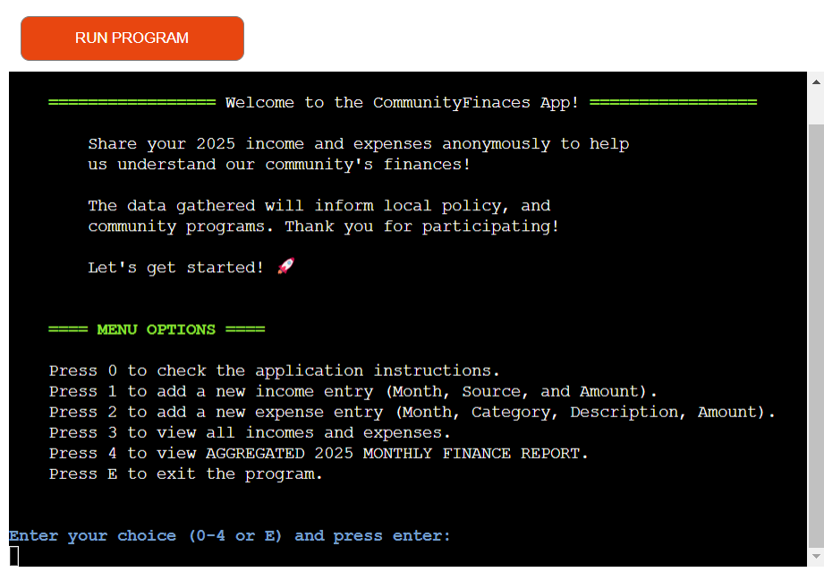

**Welcome to the FinancialSurvey2025**

    This application collects information about income and expenses
    to better understand the economic landscape of your group, region, etc!.

    Your participation will remain anonymous.
    Thank you for helping us gain a deeper understanding of personal finances!

    Let's get started! 🚀

+ The live page can be accessed via this [link](https://my-finances-tracker-5a1726e2723f.herokuapp.com/)
UPDATE
---
## Project Goals

### User Goals

+ Track and manage income and expenses on a monthly basis.
+ Generate monthly financial reports displaying total income, total expenses and cash balance (total income - total expenses).
+ Check spending patterns by viewing categorized expenses and identifying the highest expense category.
+ Quickly and easily add new income and expense entries.
+ View all their income and expense data.

### Site Owner Goals

+ Create a practical and user-friendly application to help users effectively monitor their income and expenses.
+ Ensure application functionality and bug-free performance.
+ Create an intuitive user interface.
+ Create an easy to use app.
  
---
## User Experience

### Target audience

+ Individuals who want to have an overview of their income and expenses.
+ Users who want to understand their spending habits.
+ Any user who is comfortable with using a simple computer program.
+ Users searching for a free and easy way to track finances.

### User expectations

+ Clearly understand the application's purpose.
+ Quickly and easily access the menu content.
+ Correctly store and display income and expense entries.
+ Their income and/or expense entries must be stored and displayed correctly. 
+ The monthly finance report must correctly calculate and display total income, total expenses, cash balance, expenses per category, and the highest expense.
+ The application must warn the user of any invalid input.

### User stories

+ **As a first-time user, I want to:**

  + Quickly understand the purpose of the application.
  + Have clarity in the menu options so I can find easily desired functions.
  + Have clear and easy to follow application instructions.
  + Have my results displayed clearly and concisely, using appropriate formatting and labels for easy interpretation.
  + Have a enjoyable experience without delays or glitches or errors.
  + Have an application that is visually appealing to enhance the user experience.

+ **As a returning user, I want to:**

  + Be able to quickly complete common tasks (e.g., adding income, adding expenses, generating a report), leveraging the past experience with the program.
  + The application's interface and core functionality to remain unchanged from the previous version I used, except for explicitly documented updates.
  + Have my financial data available to me within seconds, if I select to have it displayed.
  + Accomplish their tasks quickly and easily, 
  + Expect their data to be readily accessible.
  + Have an application that continues to provide value and help them monitor their finances effectively.
  + Continue having the same core financial tracking features (e.g., income/expense tracking, reporting), allowing me to monitor my finances with the same level of detail as before.

+ **As the site ownser, I want:**

  + Regularly update the website with new menu options and features (e.g., monthly, quarterly, yearly reports) to maintain user engagement.
  + Ensure a smooth and accessible user experience by regularly testing the website on different devices and browsers and addressing any reported accessibility issues within.
  + To keep the application running correctly, be free of bugs, and not crash.
  + Collect user feedback to understand user needs and identify areas for improvement.

---
## Features 

* Disclaimer in some screenshots, you will see the message what would like to do next?
This was corrected accordingly to: What would "you" like to do next?

### Welcome message

  
+ Positioned above the menu options.
+ The welcome() function displays a colorful welcome message to the user when the program starts. It uses the colorama library to add green borders, creating a visually appealing introduction to MyFinances app.
+ The welcome message already informs the user that what can be done in the program and that it is easy to use.
       
### Menu options

The Menu provides the following options:

*   **0: Application Instructions:** Learn how to use MyFinances.
*   **1: Add New Income:** Record a new income entry, by specifying the month, source, and amount.
*   **2: Add New Expense:** Record a new expense entry, by specifying the month, category, description, and amount.
*   **3: View All Records:** Display all income and expense entries in a table format.
*   **4: Monthly Finance Report:** Generate a detailed report for a specific month, showing total income, total expenses, cash balance, and a breakdown of expenses by category.
*   **E: Exit:** Close the application.

+ All input fields are required and cannot be left empty.

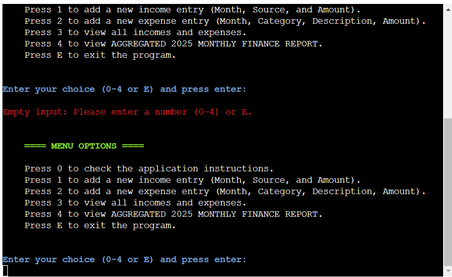

+ Leading/trailing spaces are accepted.

+ If an invalid input is entered (e.g., non-numeric characters or a number outside the valid range: 0-4), an error message is displayed, and the user is prompted to select a menu option (0-4 or E) again. 

+ All invalid inputs are handled with a clear error message (figures below).

+ E or e are accepted as valid inputs to exit the application, and a GoodBye message is displayed (Figures below).

**Menu Option 0**

+ **User inputs 0:**

+ **Application Instructions:** The application provides comprehensive instructions accessible from the main menu. These instructions cover each available feature in detail:
    *   **Adding Income:**  Users can record new income entries, specifying the month, source, and amount. The instructions explain the required format for each field and highlight the use of the European currency format for amounts.
    *   **Adding Expenses:** Users can record expenses, providing the month, category, description, and amount. Similar to income entries, the instructions detail the expected input format and the use of the European currency format.
    *   **Generating Monthly Reports:** Users can generate detailed financial reports for any month of 2025. These reports include total income, total expenses, cash balance, a breakdown of expenses by category, and the highest expense category.
    *   **Viewing All Records:** Users can view all their stored income and expense records in a tabular format. This allows for easy review and analysis of their financial data.
    *   **Exiting the Program:** Users can exit the application when finished.  The instructions reassure users that their data is safely stored.
  
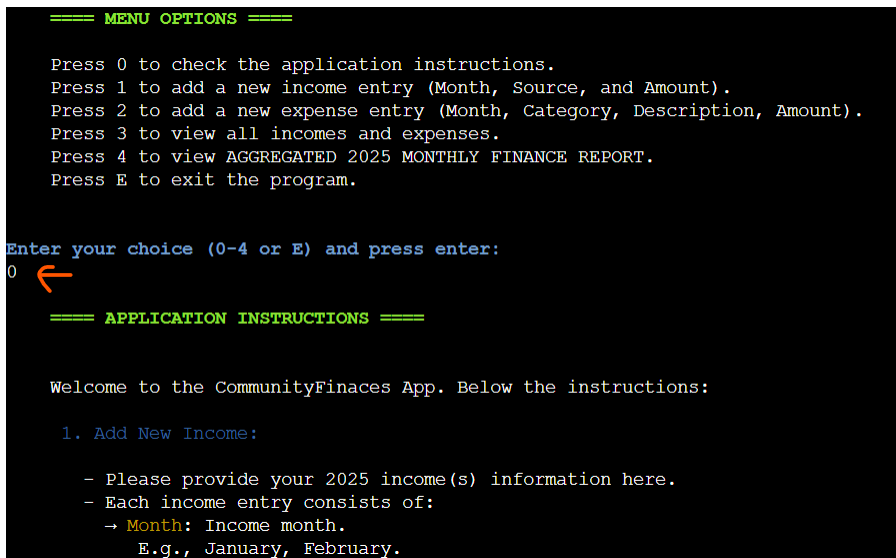

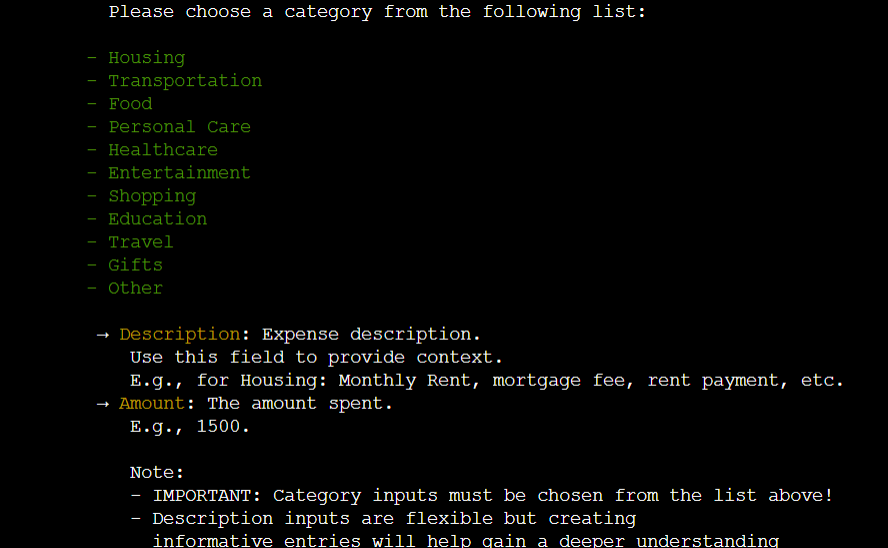
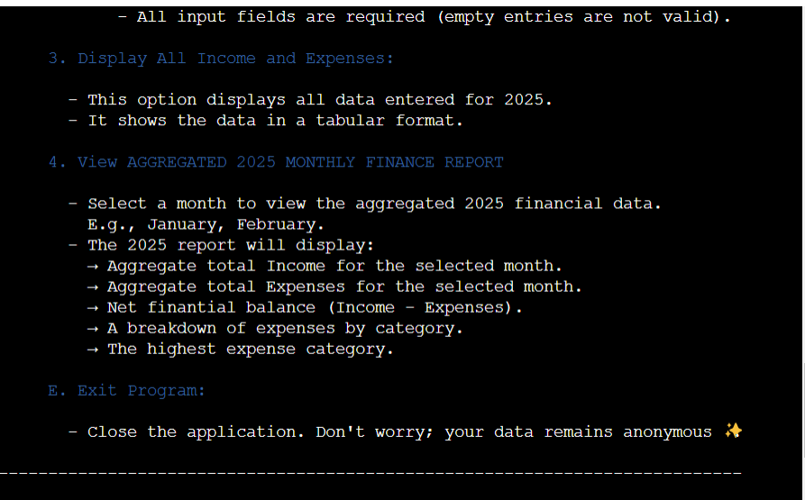

+ **Return to Menu / Exit Prompt:** After the applications instructions are displayed, the application prompts the user to either return to the main menu or exit the program. This provides a controlled flow within the application.  Invalid input (anything other than 'M' or 'E', or "m" or "e") is handled with a clear error message.

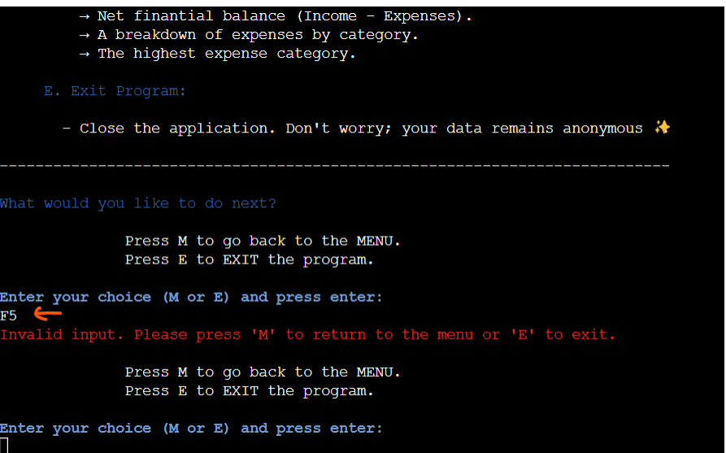

**Menu Option 1**

+ **User inputs 1:**

*   **Adding Income:** Users can easily record their income for 2025. The application guides them through the process, prompting for:
    *   **Month:** The month the income was earned (e.g., January). The application accepts full month names.
    *   **Source:** The source of the income (e.g., Salary, Freelance).  The application validates that the source is at least 4 characters long and isn't entirely numeric.
    *   **Amount:** The amount earned. The application displays and stores the amount using the standard European currency format (e.g., 1.500,00 EUR).  
    
+ All input fields are required and cannot be left empty. Example below.

+ Leading/trailing spaces are accepted (e.g., JanuarY, January, january, "    January", etc. are all accepted).

+ Including capitalization to month and source inputs is accepted.

+ The amount must be a positive number (no negative "-" sign accepted).

+ The amount ideally contains only digits, but to anticipate that an user can make a mistake, special characters or letters are accepted but are removed and not displayed.

+ All invalid inputs are handled with a clear error message. Examples below:

+ After entering the details, the application displays a message of the added income (month, source, and amount) confirming that the new income entry has been successfully stored. 

+ Users are then given the option to add another income entry, add an expense entry, return to the main menu, or exit the application. 

+ The application validates user input for these options as well, displaying an error message for invalid choices (figure below).

+ The new income record is appended (stored) to the my_finances Google cloud "incomes" worksheet (figure below).

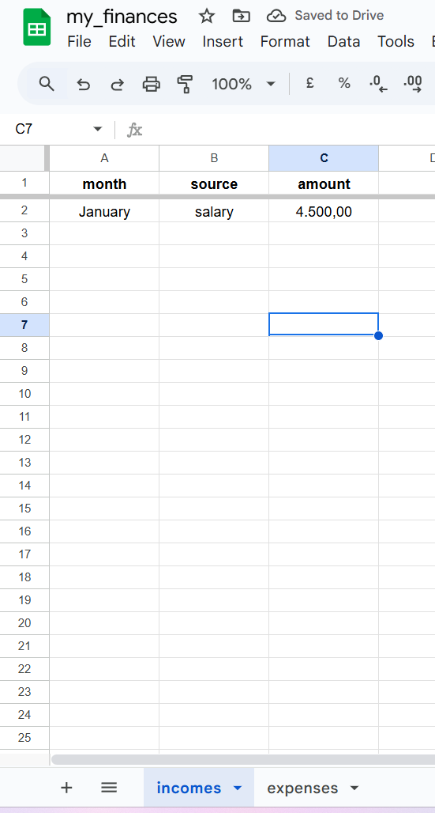

**Menu Option 2**

+ **User inputs 2:**

+   **Adding Expenses:** Users can easily record their expenses for 2025. The application prompts for the following information:
    -   **Month:** The month the expense was incurred (e.g., January).  Full month names are accepted.
    -   **Category:** The category of the expense.
    Importantly, this input was restricted to a predefined list of categories. This is because the category input is used to calculate the expenses per category and the highest expense. Therefore, data consitency was needed, an this approach resolves the problem with inconsistent category names. 
    The defined categories list is:
      - Housing
      - Transportation
      - Food
      - Personal Care
      - Healthcare
      - Entertainment
      - Shopping
      - Education
      - Travel
      - Gifts
      - Other
    -   **Description:** A description of the expense (e.g., Monthly rent, Weekly groceries). Input must be at least 4 characters long and cannot be entirely numeric. This field allows flexible input to enable users to provide detailed and personalized descriptions of their expenses, as this input is not used for calculations.
    -   **Amount:** The amount spent. The application displays and stores the amount using the standard European currency format (e.g., 1.500,00 EUR). 
  
+ All input fields are required and cannot be left empty.

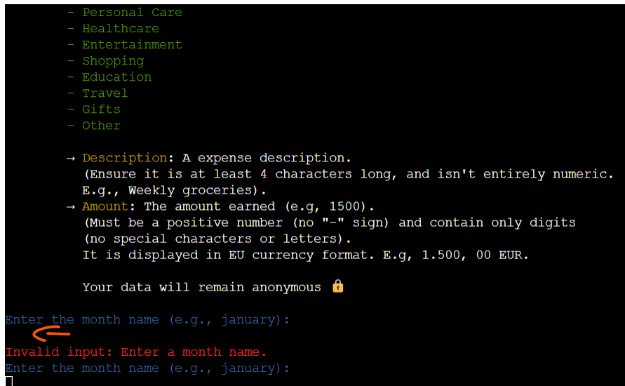

+ Leading/trailing spaces to month, category and description inputs is accepted.
(e.g., JanuarY, January, january, "    January", etc.).

+ Including capitalization to month, category and description inputs is accepted.

+ The amount must be a positive number (no negative "-" sign accepted).

+ The amount ideally contains only digits, but to anticipate that an user can make a mistake, special characters or letters are accepted but are removed and not displayed.

+ All invalid inputs are handled with a clear error message. Examples below:

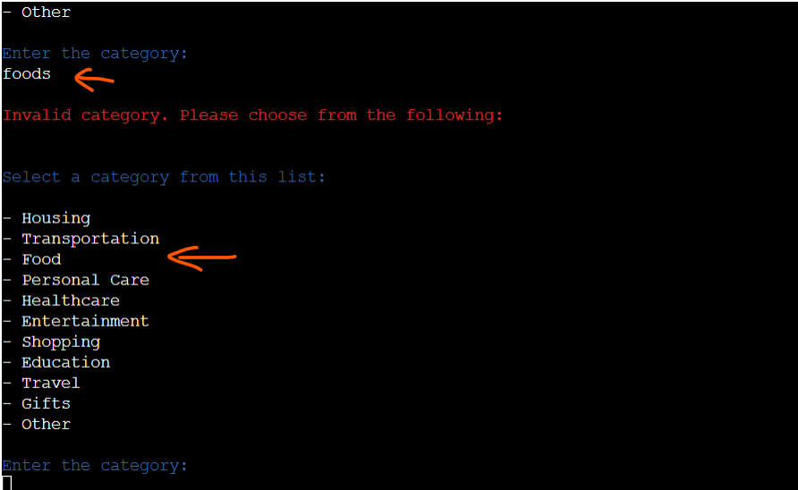

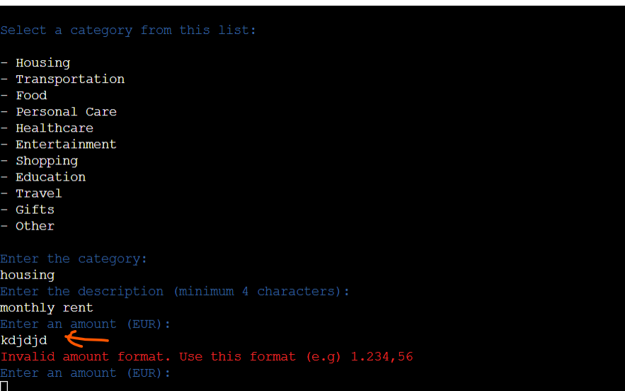

+ After entering the details, the application displays a message of the added expense (month, category, description and amount) confirming that the new expense entry has been successfully stored. 

+ Users are then given the option to add another expense entry, add an income entry, return to the main menu, or exit the application. 

+ The application validates user input for these options as well, displaying an error message for invalid choices (figure below).

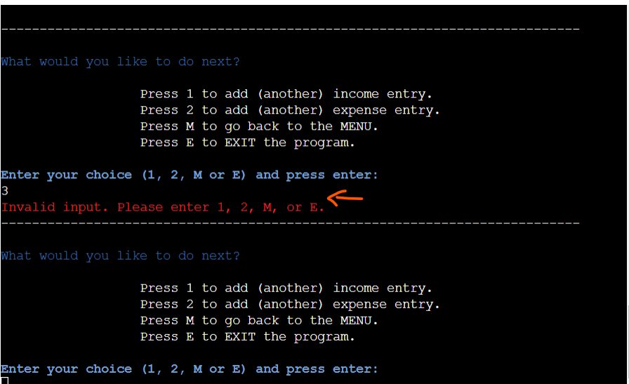

+ The new expense record is appended (stored) to the my_finances Google cloud "expenses" worksheet (figure below).

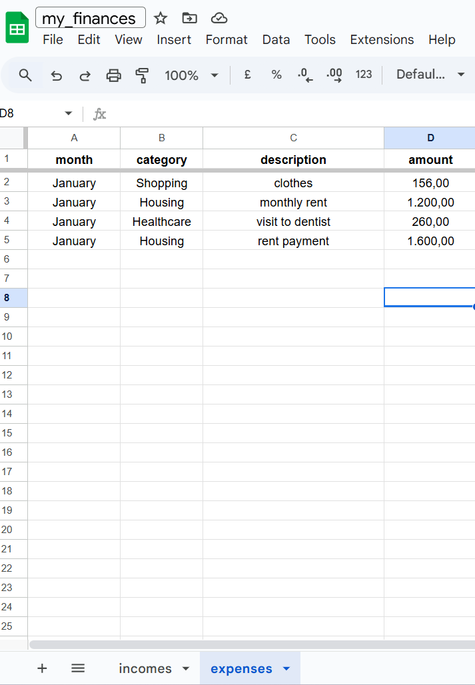

**Menu Option 3**

+ **User inputs 3:**

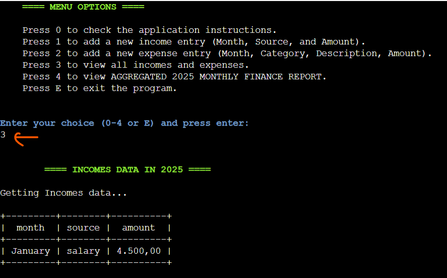

*   **Viewing Income and Expense Data:** Users can view all recorded income or expense data in a tabular format. 

+ The application retrieves the data from the specified worksheet (Incomes or Expenses) and displays it in a well-formatted table.

+ The table includes headers for each column, making the data easy to understand.

+ If there is neither income nor expense data, the application displays a message indicating that no data is available.

+ If there is income data but no expense data, the application displays a message that "no expenses data has been entered yet"

+ If there is expenses data but no income data, the application displays a message that "no income data has been entered yet"

+ The program then asks the user what they would like to do next, and displays the menu options again, with the same validations as in, for example, menu option 0. 

**Menu Option 4**

+ **User inputs 4:**

+   **Generating Monthly Finance Reports:** Users can generate detailed financial reports for any month of 2025. The report includes:
    -   **Total Income:**  The sum of all income entries for the selected month, displayed in European currency format.
    -   **Total Expenses:** The sum of all expense entries for the selected month, displayed in European currency format.
    -   **Cash Balance:** The difference between total income and total expenses for the selected month, displayed in European currency format. 
    The application clearly indicates whether the balance is positive or negative.
    🎉🎉 Positive Balance!: "cash balance amount EUR"
    🚨🚨 Negative Balance!: "cash balance amount EUR"
    -   **Expense Breakdown by Category:** A detailed breakdown of expenses for the selected month, showing the total amount spent in each category, displayed in European currency format.
    -   **Highest Expense Category:** The expense category with the highest total spending for the selected month, also displayed in European currency format.

+ The application first displays the report title in green using colorama to stand out and then prompts the user to enter the month for the report (figure above).

+ Month input field is required and cannot be left empty.

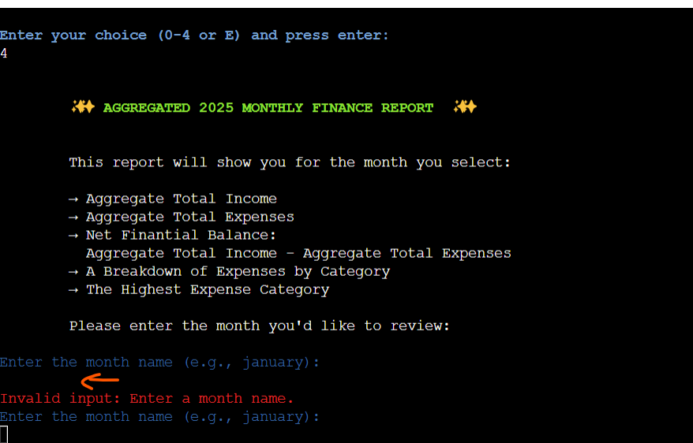

+ The application validates the user input for the month, ensuring it is a valid month name. Full month names are accepted.

+ Leading/trailing spaces are accepted (e.g., JanuarY, January, january, "    January", etc).

+ If the user enters an invalid month name (e.g., jan, or a misspelled month) an error message is displayed.
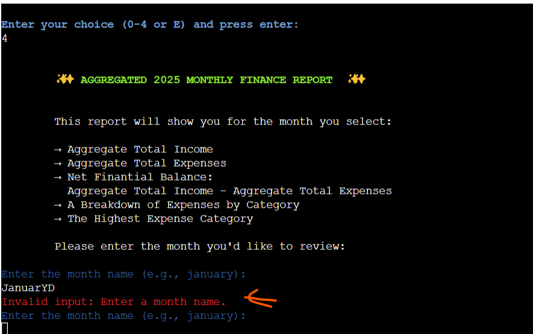

+ If there is neither income nor expense data for the selected month, a message will be displayed indicating there is no data for that month yet.

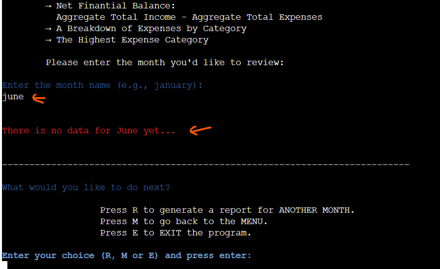

+ For a valid month input where there is income data but no expenses data, a warning message will be displayed indicating there is no expense data. In this case, the report displays total income, total expenses (0,00 EUR), cash balance, and in "expenses by category" another warning message that no expenses for this month exists.

+ For a valid month input where there is expense data but no income data, a warning message will be displayed indicating there is no income data. In this case, the report displays total income (0,00 EUR), total expenses, cash balance, expenses by category, and highest expense.

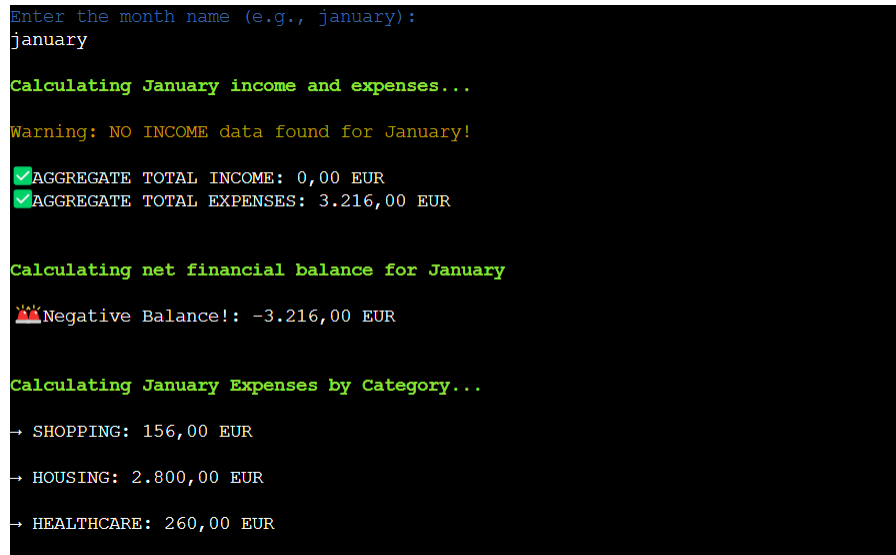

+ For a valid month input, where both, income and expenses data exist, the report displays total income, total expenses, cash balance, expenses by category, and the highest expense.

+ For example, if user has the following data:

  + Income data:
  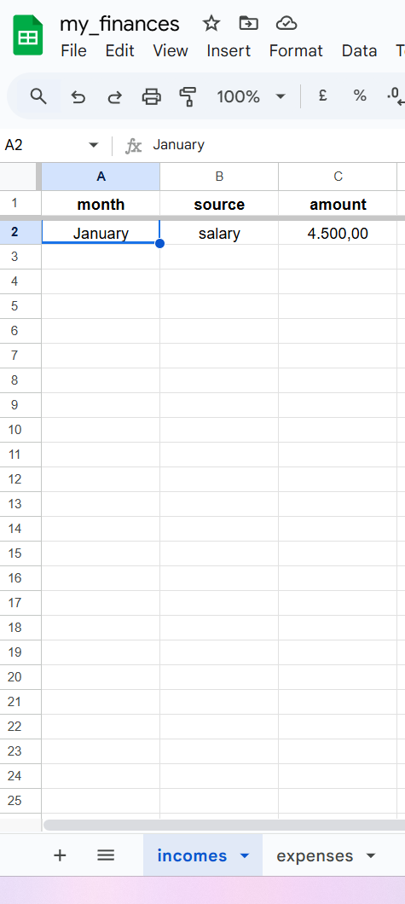

  + Expenses data:
  

  + The user will obtain the following monthly report:
  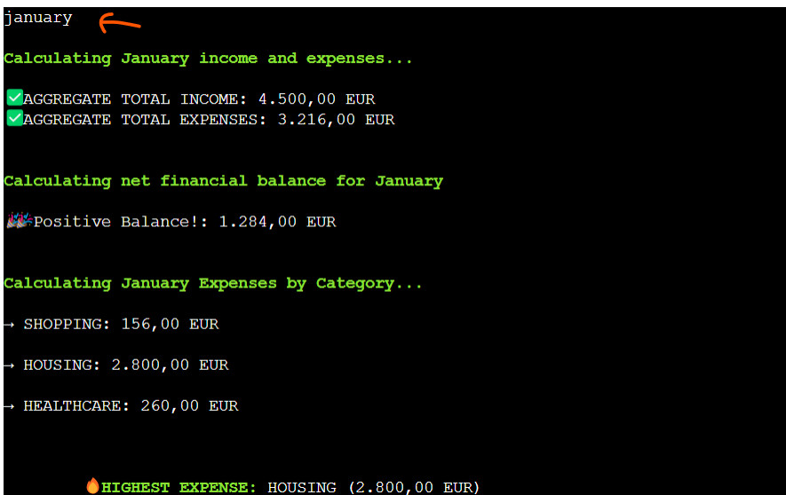

The program then asks the user what they would like to do next, and displays the menu options again, with the same validations as in, for example, menu option 0. 

**Menu Option E**

+ **Exiting the Program:** The application provides a clean exit, displaying a friendly farewell message to the user before closing.
+ This ensures a positive user experience even when leaving the application.
+ Both "e" or E" are recognized as a valid input to exit the program (figures above and below, respectively).

---
## Features left to implement

+ This project allowed me to apply my understanding of Python, object-oriented programming principles, and core programming concepts like flow control, iteration, conditional statements, functions, methods, and data structures. While I acknowdlege that a complete finance application would include more features (which I intend to add later), my focus here was on these fundamentals. 

+ Among features left to implement:

  +   **Data Editing and Deletion:** Allow users to correct mistakes, or delete their entries, to manage their financial data more effectively.

  +   **Searching:** As the data grows, it will become more difficult to find specific entries. Implementing searching capabilities would allow users to quickly locate the income or expense records they need.

  +   **Data Visualization:** While the monthly report provides a summary, visual representations of the data (charts, graphs) would make it easier for users to understand their spending habits and identify trends.

  +   **Multiple Years:** The application is currently designed to track finances for 2025 only. Future versions could allow users to select the year for tracking.

  +   **Error Handling/Input Validation Improvements:** While basic input validation is implemented, semantic validation of the "source," "category," and "description" fields could be added to further ensure meaningful input. However, to maintain flexibility for users, I have intentionally not implemented strict semantic validation at this stage, as the potential entries for these fields are limitless.  

  MISSING. IMPLEMENT 

---
## Design

+ The visual design aims to make the information readily accessible and the interaction intuitive.

+ The use of `colorama` was used to enhance the console output with colored text, improving readability and user experience.

  *   **Green:**  Used for positive messages, success indicators, titles, and section headers (e.g., "WELCOME TO MyFinances APP!", success messages).

  *   **Blue:** Used for prompts, instructions, and menu options. This color is often associated with clarity and trust, making it suitable for guiding the user. (e.g., "Enter your choice (0-4 or E) and press enter:").

  *   **Yellow:** Used for labels and field names, drawing the user's attention to the information they need to provide (e.g., "Month:", "Source:"). Yellow is also used for informational messages, such as the "No income/expenses data found" warning. This distinguishes these messages from errors, which are displayed in red.

  *   **Red:** Used for error messages, drawing the user's attention to invalid input or potential problems. (e.g., "Invalid input: Please enter a number (0-4) or E.").
  Only a few basic colors were used to highlight certain elements:

### Layout

The MyFinances application employs a consistent layout to ensure a predictable and user-friendly experience.

*   **Screen Title/Heading:** Each screen within the application has a clear title or heading, displayed in green and bold. This heading indicates the current section or function the user is interacting with (e.g., "ADD NEW INCOME," "MONTHLY FINANCE REPORT").

*   **Informative Text/Instructions:** Below the heading, most screens provide brief instructions or context-sensitive information relevant to the current task. This guides the user and explains the purpose of the screen. Prominent use of color and bold text is used to distinguish these instructions.

*   **User Input and Prompts:** At the bottom of each screen, the application prompts the user for input. Clear labels are used to indicate the expected input (e.g., "Enter the month name:").  If the user needs to choose from a set of options, these options are presented in a numbered list above the input prompt.  This structure makes it clear what the user needs to do next.

*   **Data Display:**  When displaying data (like income and expenses), the application uses the `tabulate` library to format the information into a clear, tabular format with headers. This makes it easy for users to review their financial records.

---
## Technologies Used
- [Python](https://www.python.org/)
- [GitHub](https://github.com/)
- [Gitpod](https://www.gitpod.io/): The initial development environment used to create the project files and Python code.
- [VS Code](https://gitpod.io/): A local development environment used subsequently to complete the project.
- [GitHub](https://github.com/)
- [Heroku](https://id.heroku.com/)
- [Google Sheets](https://docs.google.com/spreadsheets)
- [Google Cloud](https://console.cloud.google.com/)
- [CI Python Linter](https://pep8ci.herokuapp.com/)

## Libraries

This project utilizes the following Python libraries:

### Standard Libraries

These libraries are included with standard Python installations and provide core functionality:

- `datetime`: For working with dates and times.
- `re`: For regular expression operations (pattern matching).

### Third-Party Libraries

These libraries are external and were installed to extend the project's capabilities:

- [colorama](https://pypi.org/project/colorama/): For adding colored text output to the console.
- [gspread](https://docs.gspread.org/en/latest/index.html): For interacting with Google Sheets, enabling data manipulation and access to Google APIs.
- [google-auth](https://google-auth.readthedocs.io/en/master/): For authentication with Google APIs.  Specifically, `google.oauth2.service_account.Credentials` is used to load credentials from a `creds.json` file, facilitating secure access to the Google account.
- [tabulate](https://pypi.org/project/tabulate/): For creating nicely formatted tables for displaying data.

---
## Testing

### Validation
- In this section, the python codes was checked against the CI python linter, to spot warnings, errors and check for code qualirty. 

- The result: no errors were returned.

MISSING

+ There were no errors found in the python code using CI python linter. 

### Manual Testing

| Action | Expected result | Tested | Passed | Observations |
| --- | --- | --- | --- | --- |
| **MENU OPTIONS** | | | | | |
| User presses enter without giving an input | Empty input message appears | Yes | Yes | - |- |
| User presses a non numeric charactert | Invalid input message appears | Yes | Yes | - |- |
| User presses a number outside the valid range: 0-4 | Invalid input message appears | Yes | Yes | - |- |
| **FROM MENU, USER INPUTS 0** | | | | | |
| User inputs == 0 | Displays the "Application instructions" feature | Yes | Yes | - |- |
| User inputs == M or m to return to the MENU | Goes back to Menu options | Yes | Yes | - |- |
| User inputs == E or e to return to the MENU | Exits the program with a goodbye message | Yes | Yes | - |- |
| **FROM MENU, USER INPUTS 1** | | | | | |
| User inputs == 1 | Displays the "add new income" feature | Yes | Yes | - |- |
| User inputs different month name formats | Accepts flexible month name input: capitalized and with trailing and leading spaces (e.g., January, january, JANUARY, JanuAry, "       January   ") | Yes | Yes | - |- |
| User inputs a value that is not the complete month name | Invalid input message appears | Yes | Yes | - |- |
| User's month input is entered empty | Invalid input message appears | Yes | Yes | - |- |
| User's source is entered | Accepts any string with minimun 4 characters long, contain alphabetic characters, and not be purely numeric. | Yes | Yes | - |- |
| User inputs for "source" a string with 3 or less characters , or without alphabetic characters or purely numeric. | Invalid input message appears | Yes | Yes | - |- |
| User's source input is entered empty | Invalid input message appears | Yes | Yes | - |- |
| User inputs different amount formats (special characters and/or letters are accepted, except "-" (negative numbers),) | Accepts flexible amount input formats (e.g., 8 / 8.8 / 8,8 / 88000 / 88 000 /  88000, 26 EUR / 88000.26 / 88 000,26 / 88 000.26 / 88,000.26 / 88.000,26 ) | Yes | Yes | - |- |
| User inputs different amount formats | Converts different amount formats to the standard European format (e.g., 15.236,26 EUR)  | Yes | Yes | - |- |
| User inputs different amount formats | Converts different amount formats to the standard European format (e.g., 15.236,26 EUR)  | Yes | Yes | - |- |
| User inputs a negative amount | Invalid input message appears | Yes | Yes | - |- |
| User's amount input is entered empty | Invalid input message appears | Yes | Yes | - |- |
| After adding a new income user can return to Menu or Exit | Application prompts user to return to menu or to exit | Yes | Yes | - |- |
| After adding a new income user choose what do do next | Application prompts user to choose what to do next | Yes | Yes | 
| After adding a new income, if user inputs 1| Displays ANOTHER "Add new income" option | Yes | Yes | - |- |
| After adding a new income, if user inputs 2| Displays the "Add new expense" option | Yes | Yes | - |- |
| After adding a new income, if user inputs M or m| Goes back to the Menu options | Yes | Yes | - |- |
| After adding a new income, if user inputs E or e| Exits the program with a goodbye message | Yes | Yes | - |- |
| **FROM MENU, USER INPUTS 2** | | | | | |
| User inputs == 2 | Displays the "add new expenses" feature | Yes | Yes | - |- |
| User inputs different month name formats | Accepts flexible month name input: capitalized and with trailing and leading spaces (e.g., January, january, JANUARY, JanuAry, "       January   ") | Yes | Yes | - |- |
| User inputs a value that is not the complete month name | Invalid input message appears | Yes | Yes | - |- |
| User's month input is entered empty | Invalid input message appears | Yes | Yes | - |- |
| User's category is entered | Accepts only a predefined list of categories | Yes | Yes | - |- |
| User's category is entered | The predefined list of categories is correctly and clearly listed | Yes | Yes | - |- |
| User's category input is entered empty | Invalid input message appears | Yes | Yes | - |- |
| User's description is entered | Accepts any string with minimun 4 characters long, contain alphabetic characters, and not be purely numeric. | Yes | Yes | - |- |
| User inputs for "description" a string with 3 or less characters, or without alphabetic characters or purely numeric. | Invalid input message appears | Yes | Yes | - |- |
| User's description input is entered empty | Invalid input message appears | Yes | Yes | - |- |
| User inputs different amount formats (special characters and/or letters are accepted, except "-" (negative numbers),) | Accepts flexible amount input formats (e.g., 8 / 8.8 / 8,8 / 88000 / 88 000 /  88000, 26 EUR / 88000.26 / 88 000,26 / 88 000.26 / 88,000.26 / 88.000,26 ) | Yes | Yes | - |- |
| User inputs different amount formats | Converts different amount formats to the standard European format (e.g., 15.236,26 EUR)  | Yes | Yes | - |- |
| User inputs different amount formats | Converts different amount formats to the standard European format (e.g., 15.236,26 EUR)  | Yes | Yes | - |- |
| User inputs a negative amount | Invalid input message appears | Yes | Yes | - |- |
| User's amount input is entered empty | Invalid input message appears | Yes | Yes | - |- |
| After adding a new expense user can return to Menu or Exit | Application prompts user to return to menu or to exit | Yes | Yes | - |- |
| After adding a new expense user choose what do do next | Application prompts user to choose what to do next | Yes | Yes | 
| After adding a new expense, if user inputs 1| Displays "Add new income" option | Yes | Yes | - |- |
| After adding a new expense, if user inputs 2| Displays "Add ANOTHER new expense" option | Yes | Yes | - |- |
| After adding a new expense, if user inputs M or m| Goes back to the Menu options | Yes | Yes | - |- |
| After adding a new expense, if user inputs E or e| Exits the program with a goodbye message | Yes | Yes | - |- |
| **FROM MENU, USER INPUTS 3** | | | | | |
| User inputs == 3 | Displays the "view all your income and expenses" feature | Yes | Yes | - |- |
| If there is income data but no expenses data | Income data is displayed but also a message indicating there is no expense data yet | Yes | Yes | - |- |
| If there is expenses data but no income data | Expenses data is displayed but also a message indicating there is not income data yet | Yes | Yes | - |- |
| if there is neither income or expense data | A message is displayed indicating that there is no income or expenses data yet | Yes | Yes | - |- |
| After view all your income and expenses, if user inputs M or m| Goes back to the Menu options | Yes | Yes | - |- |
| After view all your income and expenses, if user inputs E or e| Exits the program with a goodbye message | Yes | Yes | - |- |
| **FROM MENU, USER INPUTS 4** | | | | | |
| User inputs == 4 | Displays the "monthly finance report" feature | Yes | Yes | - |- |
| User inputs different month name formats | Accepts flexible month name input: capitalized and with trailing and leading spaces (e.g., January, january, JANUARY, JanuAry, "       January   ") | Yes | Yes | - |- |
| User inputs a value that is not the complete month name | Invalid input message appears | Yes | Yes | - |- |
| User's month input is entered empty | Invalid input message appears | Yes | Yes | - |- |
| User input for month is empty | Invalid input message appears | Yes | Yes | - |- |
| If month input has no data yet | A message is displayed indicating that month has no data | Yes | Yes | - |- |
| After displaying the monthly finance report, if user inputs M or m| Goes back to the Menu options | Yes | Yes | - |- |
| After displaying the monthly finance report,, if user inputs E or e| Exits the program with a goodbye message | Yes | Yes | - |- |
| **FROM MENU, USER INPUTS 5** | | | | | |
| User inputs == 5 | Exits the program with a goodbye message | Yes | Yes | - |- |

---
## Bugs
+ ### Solved bugs
  1. A call to generate_monthly_finance_report failed because it's a method of the FinanceManager class and required a class instance. However, the call in the handle_user_option was not associated with an instance.
        - Solution: this mistake was spotted and corrected.

  2. The creds.json file dissappeared from the workspace after adding it to 
  .gitignore. It is not clear why that happened, because the .gitignore should just prevent it from being pushed to GitHub. Thus, it should still be present but greyed-out.
      - Solution: I added it back to the workspace and saved it once again.

  3. The application encountered errors when processing amount inputs that included commas (e.g., "1,500"). Direct conversion of these strings to floating-point numbers resulted in a ValueError. 
      - Solution: the code now pre-processes amount strings to remove commas before attempting numerical conversion, ensuring successful calculations.

+ ### Unfixed bugs

There are no known unfixed bugs.

---
## Deployment

The site was deployed using Heroku following the following steps:
1. Run "pip3 freeze > requirements.txt" in the terminal then commit and push it to GitHub. Make sure you have named this requirements file the same, all lowercase, and check for typos.
2. Get a Heroku account (or log in if you already have one).
3. To create a new app, click "new" (top right) and choose "create new app."
4. Name your app, select a region, and click "Create app."
5. In the "settings" tab, go to Config Vars and press "Reveal Config Vars".
6. In the field for KEY add "CREDS" and into VALUE field copy & paste entire content of creds.json file, and click "Add".
7. Below add another Config Var with KEY = "PORT" & VALUE = "8000".
8. Add Buildpacks: first python and then node.js below. This specific order is crucial.
9. Go to the "Deploy" tab and choose GitHub for Deployment method, click "Connect to GitHub".
10. Search for the repository you would like to deploy and and click on "Connect".
11. Enable either automatic deployment by clicking on the button "Enable Automatic Deploys" in the "Automatic Deploys" Section or deploy a branch manually by selecting the branch and clicking the button "Deploy Branch" in the "Manual deploys" section.
12. Allow the application build process to complete. Then, click the "View" link to access your deployed application.

The live link can be found here: MISSING

## Local Deployment

### Forking

To have a copy of the project in your repositories:
1. Log in or sign up to GitHub.
3. Navigate to the [project repository](https://github.com/ParedesGab/PP2-the-cosmic-match-memory-game). MISSING
4. In the top right corner, click the "Fork" button.
5. A new page titled "Create a new fork" will appear. Optionally, you can edit the repository name.
6. At the bottom of the page, click "Create fork."

### Cloning

1. Log in or sign up to GitHub.
2. Go to the [project repository](). MISSING
3. Click the green button "Code" and choose your preferred cloning method (for example: HTTPS, SSH, or GitHub CLI) and copy the provided url.
4. Open the terminal in your preferred code editor and change the current working directory to the one where you want the cloned directory
5. Run git clone in the terminal, paste the copied link, and press Enter.

---
## Credits 

### Content

- Inspired by my mother, Marcela Rojas, a business administrator, I initially envisioned a personal finance tracker. This evolved, however, into a financial survey to collect and analyze collective income and expense data, as individual tracking proved impractical for a shared dataset.

- [W3 Schools](https://www.w3schools.com/python/python_regex.asp) showed me how to use the Regular Expressions (`re`) module.

- [Recursos Python](https://recursospython.com/guias-y-manuales/colorama-texto-fondo-coloreados-la-consola/) showed me how to use the `colorama` library.

- I got further clarificaion on the used of Python Object Oriented Programming from the from the YouTube channel [Bro Code](https://www.youtube.com/watch?v=q2SGW2VgwAM).

- A list of common expense categories was compiled for this project, drawing inspiration from standard budgeting practices and personal finance resources. Among platforms I researched: [Bureau of Labor Statistics (BLS) Consumer Expenditure Surveys](https://www.bls.gov/cex/) and the [YNAB budgeting app](https://www.ynab.com/).

- [Stack Overflown](https://stackoverflow.com/questions/61699115/b-vs-b-in-datetime-module-python-3/) showed me the method for interpreting the month input as a full month name (`datetime.strptime(user_month, "%B")`).

## Acknowledgments

- My sincere gratitude to code institute specially to Kristyna, and tutor suport for the great tips and feedback.

- Thank you to my mentor, Iuliia Konovalova, for her important feedback.

- A heartfelt thanks to my family for their support during this project.