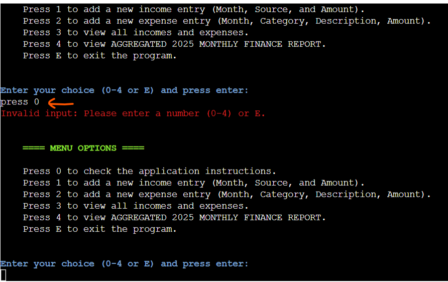

# My Finances Tracker App

(Developer: Gabriela Fabiola Paredes Rojas)

**Welcome to MyFinances tracker APP!**

  This expense tracker will help you monitor
  your income and expenses!
  Are you ready to understand your spending habits?
  Let's go!

+ The live page can be accessed via this [link]()

---
## Project Goals

### User Goals

+ Track and manage income and expenses on a monthly basis.
+ Generate monthly financial reports displaying total income, total expenses and cash balance (total income - total expenses).
+ Check spending patterns by viewing categorized expenses and identifying the highest expense category.
+ Quickly and easily add new income and expense entries.
+ View all their income and expense data.

### Site Owner Goals

+ Create a practical and user-friendly application to help users effectively monitor their income and expenses.
+ Ensure application functionality and bug-free performance.
+ Create an intuitive user interface.
+ Create an easy to use app.
  
---
## User Experience

### Target audience

+ Individuals who want to have an overview of their income and expenses.
+ Users who want to understand their spending habits.
+ Any user who is comfortable with using a simple computer program.
+ Users searching for a free and easy way to track finances.

### User expectations

+ Clearly understand the application's purpose.
+ Quickly and easily access the menu content.
+ Correctly store and display income and expense entries.
+ Their income and/or expense entries must be stored and displayed correctly. 
+ The monthly finance report must correctly calculate and display total income, total expenses, cash balance, expenses per category, and the highest expense.
+ The application must warn the user of any invalid input.

### User stories

+ **As a first-time user, I want to:**

  + Quickly understand the purpose of the application.
  + Have clarity in the menu options so I can find easily desired functions.
  + Have clear and easy to follow application instructions.
  + Have my results displayed clearly and concisely, using appropriate formatting and labels for easy interpretation.
  + Have a enjoyable experience without delays or glitches or errors.
  + Have an application that is visually appealing to enhance the user experience.

+ **As a returning user, I want to:**

  + Be able to quickly complete common tasks (e.g., adding income, adding expenses, generating a report), leveraging the past experience with the program.
  + The application's interface and core functionality to remain unchanged from the previous version I used, except for explicitly documented updates.
  + Have my financial data available to me within seconds, if I select to have it displayed.
  + Accomplish their tasks quickly and easily, 
  + Expect their data to be readily accessible.
  + Have an application that continues to provide value and help them monitor their finances effectively.
  + Continue having the same core financial tracking features (e.g., income/expense tracking, reporting), allowing me to monitor my finances with the same level of detail as before.

+ **As the site ownser, I want:**

  + Regularly update the website with new menu options and features (e.g., monthly, quarterly, yearly reports) to maintain user engagement.
  + Ensure a smooth and accessible user experience by regularly testing the website on different devices and browsers and addressing any reported accessibility issues within.
  + To keep the application running correctly, be free of bugs, and not crash.
  + Collect user feedback to understand user needs and identify areas for improvement.

---
## Features 

### Welcome message

  
+ Positioned above the menu options.
+ The welcome() function displays a colorful welcome message to the user when the program starts. It uses the colorama library to add green borders, creating a visually appealing introduction to MyFinances app.
+ The welcome message already informs the user that what can be done in the program and that it is easy to use.
       
### Menu options

The Menu provides the following options:

*   **0: Application Instructions:** Learn how to use MyFinances.
*   **1: Add New Income:** Record a new income entry, by specifying the month, source, and amount.
*   **2: Add New Expense:** Record a new expense entry, by specifying the month, category, description, and amount.
*   **3: View All Records:** Display all income and expense entries in a table format.
*   **4: Monthly Finance Report:** Generate a detailed report for a specific month, showing total income, total expenses, cash balance, and a breakdown of expenses by category.
*   **E: Exit:** Close the application.

+ It gets the user selection and validates the selection.
+ The application validates user input. If an invalid input is entered (e.g., non-numeric characters or a number outside the valid range: 0-4), an error message is displayed, and the user is prompted to select a menu option (0-4 or E) again (Figures below).

+ E or e are accepted as valid inputs to exit the application and a GoodBye message is displayed (Figures below).

**Menu Option 1**

+ 1 it is recognized as a valid input.
+ The application first displays the report title in green using colorama to stand out.
+ When generating a monthly report, the application prompts the user for the month name (case-insensitive).
+ If the month is valid, the report displays the total income, total expenses, cash balance, a breakdown of expenses by category, and the highest expense.
  - Calculates Monthly Income and Expenses
  

  - Calculates Cash Balance
  

  - Calculates Expenses By Category and Highest expense
  
  
  - The program then asks the user what they would like to do next, and displays the menu options again.

+ If the user enters an invalid month name (e.g., jan, or a misspelled month) a ValueError is caught, and an error message is displayed (figure below).
  
  - The user is asked again to enter a month name. 

+ If the entered month is valid but no income or expense data exists for that month, the application displays a message indicating that there is no data for that month yet.
  
  - The user is then asked what they would like to do next, and displays the menu options again (figure below). This was intentionally selected because the user might want to view all their data, add data for that month, exit the program, etc.

**Menu Option 2**

+ 2 it is recognized as a valid input.
+ The application displays all the avaiable financial data, for both income and expenses.
  - Income data
  

  - Expenses data
  
  

+ The program then asks the user what they would like to do next, and displays the menu options again.

**Menu Option 3**

+ 3 it is recognized as a valid input.
+ The application first displays a title in green, using colorama to stand out, prompting the user that "To add a new income:" first they need to add a month name (case-insensitive).

+ If the user enters an invalid month name (e.g., jan, or a misspelled month) a ValueError is caught, and an error message is displayed (figure below).
  
  - The user is asked again to enter a month name. 

+ If the month is valid, the report then prompts the user to enter their income source. Note, the income source accepts any data type. Thus, any text can be entered.

+ After entering the income source, the report then prompts the user to enter their income amount. Note, the income source accepts only numbers (integers or floats). If the user enters something that is not a number, the application will ask you to enter the amount again.

+ Once all the information was entered, the application will display a confirmation message.

+ The updated income data will then be displayed, so you can verify that the new record has been added correctly.

+ The new income record is appended to the Google sheet (Figures below).
  - Initial Google worksheet
  

  - Updated Google worksheet
  

+ Finally, the user is returned to the menu options, where they can choose their next action.

**Menu Option 4**

+ 3 it is recognized as a valid input.
+ The application first displays a title in green, using colorama to stand out, prompting the user that "To add a new income:" first they need to add a month name (case-insensitive).

+ If the user enters an invalid month name (e.g., jan, or a misspelled month) a ValueError is caught, and an error message is displayed (figure below).
  
  - The user is asked again to enter a month name. 

+ If the month is valid, the report then prompts the user to enter their income source. Note, the income source accepts any data type. Thus, any text can be entered.

+ After entering the income source, the report then prompts the user to enter their income amount. Note, the income source accepts only numbers (integers or floats). If the user enters something that is not a number, the application will ask you to enter the amount again.

+ Once all the information was entered, the application will display a confirmation message.

+ The updated income data will then be displayed, so you can verify that the new record has been added correctly.

+ The new income record is appended to the Google sheet (Figures below).
  - Initial Google worksheet
  

  - Updated Google worksheet
  

+ Finally, the user is returned to the menu options, where they can choose their next action.

---
## Features left to implement

- Implement a more dynamic galaxy-themed background (e.g., moving nebulas).

- Add a space-themed sound effect by implementing an event listener in JavaScript that triggers whenever a match occurs.

- Add animations for card flips and matches to enhance the user experience.

- Implement visual feedback (e.g., a highlight) for matched pairs.
- Allow users to navigate back to the home page directly from the memory game. Please note that for now this option was intentionally excluded to encourage players to stay on the game page longer, with the added flexibility to restart the game if they wish.

---
## Design

### Color scheme

**Main color scheme**

- The russian violet (blue), seasalt (white) and davy's gray color where used as the main colors of the website. Their choice was inspired by the universe background image and their used keeps the website cohesive.

- The russian violet (blue) was used for the titles, button names and the paragraph within the Game indications section.

- All buttons except for the button with class btn--restart, used as box shadow the color davy's gray color. 

**Secondary color scheme**

- To simulate colors of the universe the hover effect used two colors as gradient: Royal purple ( #7943af) and Sapphire ( #3455af). 

- The button with the class btn--restart and the congratulatory message are styled in Sinopia orange to ensure that they stand out. This vibrant choice draws attention to the restart option, making it easy for users to replay the game, and highlights the victory message effectively, celebrating the user's success in a visually striking way.

### Typography

- "Rajdhani" and "Roboto" from Google Fonts were used as the primary and secondary font of the website, respectively. 
- The generic family name is "Sans-serif".
- For the titles (h1 and h2) letter-spacing CSS property with a value of 0.3rem was used, to add a slight space between letters in the text.

---
## Wireframes

#### Mobile

- [Mobile: Home menu page](documentation/wireframes/main-page-mobile.png)
- [Mobile: Games indications page](documentation/wireframes/game-instructions-mobile.png)
- [Mobile: Memory board game page](documentation/wireframes/memory-board-game-mobile.png)
- [Mobile: Congratulations page](documentation/wireframes/congratulations-mobile.png)

---
## Technologies used
- [HTML](https://developer.mozilla.org/en-US/docs/Web/HTML)
- [CSS](https://developer.mozilla.org/en-US/docs/Web/CSS)
- [JavaScript](https://developer.mozilla.org/en-US/docs/Web/JavaScript)
- [Gitpod](https://www.gitpod.io/): the development environment to create the project files, folders and html, css and javascript codes.
- [GitHub](https://github.com/): to store the repository, bug track and see the deployed version.
- [Balsamiq](https://balsamiq.com/): to create the wireframes.
- [Google Fonts](https://fonts.google.com/): to import the Rajdhani and Roboto family fonts.
- [TinyPNG](https://tinypng.com/): to compress the images.
- [Flaticon](https://www.flaticon.com/): source of the memory card images.
- [Favicon.io](https://favicon.io/): source of the favicon images.
- [Am I responsive?](https://ui.dev/amiresponsive): to generate the responsive mockup image.
- [MDN Web Docs](https://developer.mozilla.org/en-US/): resource to check CSS properties and javascript syntax and definition descriptions.
- [Color-hex](https://www.color-hex.com/): to get the rgb color information.
- [Chrome DevTools](https://developer.chrome.com/docs/devtools?hl=de) and its open source [Lighthouse](https://developer.chrome.com/docs/lighthouse?hl=de).
-  [W3C HTML](https://validator.w3.org/) and [W3C CSS](https://jigsaw.w3.org/css-validator/) Validation Services. 
- [JSHint](https://jshint.com/): to detect errors and potential problems in the JavaScript code.
- [WAVE](https://wave.webaim.org/): to test accessibility.
- [DeepL Write](https://www.deepl.com/en/write): to spot spelling mistakes in the text. 

---
## Testing

### Validation
- In this section, the HTML and CSS codes were checked for compliance with industry standards. This was done using the W3C Markup Validation Service for HTML and CSS respectively, using the code from both: the working environment and the the deployed version.

- The result in both reports: no errors were returned.

#### HTML Validation

+ There were no errors found in the javascript code using the JS Hint Validator. 

### Accessibility 

Accessibility was tested using the Web Accessibility Evaluation Tool (WAVE report below), and no errors were reported. 

### LightHouse report

Lighthouse tool from Devtools was used to confirm that the website is performing well, is accessible and the colors and fonts chosen are readable.

### Responsiveness

- The website was checked across devices using the chrome extension [Responsive Viewer](https://chromewebstore.google.com/detail/responsive-viewer/inmopeiepgfljkpkidclfgbgbmfcennb?hl=en). 

- In addition, it was manually checked in the following devices:
  - Huawei Y9 Prime 2019
  - Iphone XR
  - Iphone 15 pro
  - Samsung Galaxy S8

### Manual Testing

| Feature | Action | Expected result | Tested | Passed | Observations |
| --- | --- | --- | --- | --- | --- |
| **Home Menu Page** | | | | | |
| Header | Game name display | The title is centered and positioned as the topmost element on the page and it is readable | Yes | Yes | - |- |
| Play Game! button | Click on the Play Game! button | Redirects to the Memory Board Game page | Yes | Yes | - |
| Play Instructions button | Click on the Play Instructions button | Redirects to the Game Indications page | Yes | Yes | - |
| Both Home menu buttons | Hover over them | The buttons will rotate slightly and change colors to a gradient of blue and purple | Yes | Yes | 
| Both Home menu buttons | Buttons displayed | The buttons are centered one of top of the other with a consisting style, and they are readable | Yes | Yes | 
| **Game Indications Page** | | | | | |
| Header | Game name display | The title is centered and positioned as the topmost element on the page and it is readable | Yes | Yes | - |- |
| Game indications text | Text display| The paragraph stands out, the content is justified with no spelling mistakes | Yes | Yes | - |
| Images | Images display | The images are loading correctly, they have the same style and dimensions, and are located  below the text| Yes | Yes | - |
| Home Menu button | Click on the Home Menu button | Redirects to the Home Menu page | Yes | Yes | - |
| **Memory Board Game Page** | | | | | |
| Header | Game name display | The title is centered and positioned as the topmost element on the page and it is readable | Yes | Yes | - |- |
| Game Board | Game board display | It stands out and it is centered | Yes | Yes | - |
| Memory cards | Cards display | They have identical dimensions and are arranged in a grid layout. Initially, they appear "closed" with a white background. A hover effect is applied, and the cursor changes to indicate that they are clickable.| Yes | Yes | - |
| Game logic | Game logic | The images are revealed only when clicked. Once a card is clicked, it becomes disabled and cannot be clicked again. After the user clicks two cards, they are re-enabled for further interactions. Each time the user clicks two cards, the "moves" count increases by 1. However, the "score" only increases by 100 when a match is made. The player wins once their score reaches 800 | Yes | Yes | - |
| Restart Game button | Restarts the game | It restarst the game at any time | Yes | Yes | - |
| Restart Game button | Hover over them | The button will rotate slightly and change colors to a gradient of blue and purple | Yes | Yes | - |
| **Game Finished Congratulations Page** | | | | | |
| Header | Game name display | The title is centered and positioned as the topmost element on the page and it is readable | Yes | Yes | - |- |
| Game Finished - Congratulations Page | Page displays | This page appears 4s after the player has won | Yes | Yes | - |
| Congratulations text | Text display | The paragraph stands out, the content is centered with no spelling mistakes | Yes | Yes | - |
| Home Menu button | Click on the Home Menu button | edirects to the Home Menu page | Yes | Yes | - |
| Play Again! button | Click on the Play Again! button | Redirects to the Memory Board Game page | Yes | Yes | - |
| Both buttons | Hover over them | The buttons will rotate slightly and change colors to a gradient of blue and purple | Yes | Yes | 
| Both buttons | Buttons displayed | The buttons are centered one of top of the other with a consisting style, and they are readable | Yes | Yes | 

---
## Browser compatibility

The website was tested on the following browsers:
- Google Chrome
- Firefox
- Microsof Edge

---
## Bugs
+ ### Solved bugs
  1. The W3C Markup validation detected the below error in the HTML code:
  
        - Solution: this mistake was spotted and corrected. 

  2. The W3C Markup validation detected the below warnings in the HTML code:
    
      - Solution: To enhance the HTML syntax, a hidden H2 heading was added to each section without an existing heading.

  3. JSHint showed the following warning:
    
      - Solution: Although the original code was functioning correctly, the event listener logic was updated to avoid any potentially confusing semantics. A separate click handler function was created. This change ensures the correct card index is captured using a closure for the handleCardFlip function.

+ ### Unfixed bugs

  1. JSHint showed the following warning:

    
    
    - As described in the "Features left to implement" section, due to time constraints, I used onclick in all buttons of the HTML document for faster implementation. However, I recognize that mixing structure (HTML) with functionality (JS) is not best practice, as it can make the code harder to maintain and does not facilitate collaboration in team environments. After the project is graded, I plan to refactor the code by removing inline onclick attributes, and instead handling events via JavaScript by adding event listeners, ensuring better separation of concerns and improving maintainability.
  
---
## Deployment

The website has been deployed to GitHub pages following these steps:

1. In the GitHub repository for The Cosmic Match Memory Game [GitHub repository](https://github.com/ParedesGab/PP2-the-cosmic-match-memory-game), select the "Settings" tab.

2. Click on "Pages" from the field "Code and automation" (on the left), and select the below settings:
    - Source: deploy from a branch.
    - Branch: main.
    - click "Save".

3. Select the "Code" tab and refresh the page. 

4. On the right side of the page, a "Deployments" section has been activated indicating a successful deployment. 

5. The live link can be accessed [here](https://paredesgab.github.io/PP2-the-cosmic-match-memory-game/).

## Local Deployment

### Forking

To have a copy of the project in your repositories:
1. Log in or sign up to GitHub.
3. Navigate to the [project repository](https://github.com/ParedesGab/PP2-the-cosmic-match-memory-game).
4. In the top right corner, click the "Fork" button.
5. A new page titled "Create a new fork" will appear. Optionally, you can edit the repository name.
6. At the bottom of the page, click "Create fork."

### Cloning

1. Log in or sign up to GitHub.
2. Go to the [project repository](https://github.com/ParedesGab/PP2-the-cosmic-match-memory-game).
3. Click the green button "Code" and choose your preferred cloning method (for example: HTTPS, SSH, or GitHub CLI) and copy the provided url.
4. Open the terminal in your preferred code editor and change the current working directory to the one where you want the cloned directory
5. Run git clone in the terminal, paste the copied link, and press Enter.

---
## Credits 

### Content 

- The Code institute ci-full-template was used to create the GitHub repository of the Cosmic Match Memory Game website.

- [W3 Schools](https://www.w3schools.com/jsref/met_win_settimeout.asp) showed me how to use the setTimeout() method. 

- [W3 Schools](https://www.w3schools.com/jsref/prop_html_id.asp) showed me how to return the id property. 

- [MDN Web Docs](https://developer.mozilla.org/en-US/docs/Web/CSS/border-radius) showed me how to create elliptical corner radius used in the Control Area of the Memory Board Game section.

- I got further clarificaion on the used of Parameters vs Arguments from the from the YouTube channel [Anna McDougall](https://www.youtube.com/watch?v=5o4P8lESTF0).

- Stack Overflow solutions was also used to resolve doubts.

- Text was checked with DeepL Write for spelling mistakes. 

- I learned how to add other pages (e.g., home menu page, games indications and congratulations pages) with Javascript by reading the project of [Kristyna Wach](https://github.com/Cushione/four-seasons-memory-game) and testing it myself within my javascript code.

- Inspiration for memory game logic comes from the YouTube Channels [developedbyed](https://www.youtube.com/watch?v=-tlb4tv4mC4&t=3095s) and [Victor Talamantes](https://www.youtube.com/watch?v=c0eigGnotm0). However, I did  not relied on them and customized it my way.

- ReadMe was inspired and guided by the ReadMe documents of my mentor Iuliia Konovalova, of my previous Kamil Wojciechowski, and of the love running project. 

### Media
  
- The universe background image is from [Federico Beccari](https://unsplash.com/de/@federize?utm_content=creditCopyText&utm_medium=referral&utm_source=unsplash).

- All memory card images are from [Icongeek26](https://www.flaticon.com/authors/icongeek26).

## Acknowledgments

- My sincere gratitude to my mentor, Iuliia Konovalova, for her valuable feedback.  
- Thank you to Code Institute, specially to Kamil, Kristyna, and Lane for the great tips and feedback.
- Thank you to my brother Brando, Your beautiful piano music [Brando PR](https://www.youtube.com/@BrandoPR) accompanied me along this project as well.
- I am deeply grateful to Geddi and Alexis for their insightful JavaScript fundamentals guidance.
- A heartfelt thanks to my husband Johannes for "playing! (testing)
 the game more times than I can count. 
